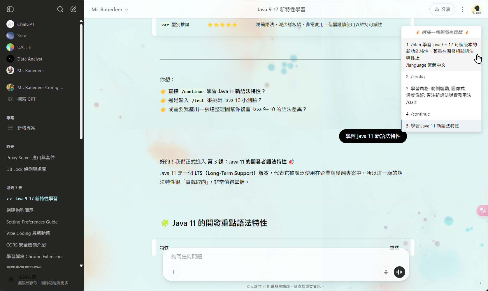

{width=800}

# ChatGPT 聊天的優化擴充

目前實作功能:
1. 聊天主區域問項導覽列，可以快速跳轉 (複製 Notion 功能)
2. 聊天主區域上方 sticky bar 顯示聊天主題
3. 左側聊天列表，偵測目前所在主題，新增 css class `my-active-chat`，方便自訂顯示 (可以搭配 [superstyle 外掛](https://microsoftedge.microsoft.com/addons/detail/super-styles/lgcjpmgldoadgddlhigdadahfdecchcp) 或其他可以自訂頁面的 css 瀏覽器外掛。分享[我的superstyle自訂](ben-superstyle-custom-chatgpt.md))
