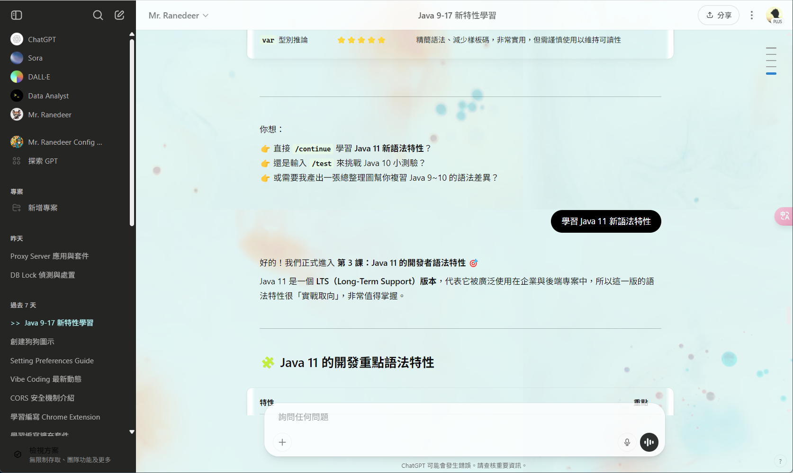

```css
/* sidebar 背景 */
.bg-token-sidebar-surface-primary,
.bg-token-bg-elevated-secondary {
  // background-color: #fffaf0;
  background-color: #252524;
}

.bg-token-sidebar-surface-primary .text-token-text-primary,
.bg-token-sidebar-surface-primary button {
    color: #b8b6b6;
}

.bg-token-sidebar-surface-primary a:hover,
.bg-token-sidebar-surface-primary a:hover .text-token-text-primary,
.bg-token-sidebar-surface-primary button:hover {
    color: black;
}

/* chatgpt built-in active chat selector */
.bg-\[var\(--sidebar-surface-tertiary\)\] {
  background: none;
}

.bg-\[var\(--sidebar-surface-tertiary\)\] a {
  color: #b8fbff !important;
}

.bg-\[var\(--sidebar-surface-tertiary\)\] a:before {
    content: '>>'
}

.my-active-chat {
    color: #b8fbff;
}

.my-active-chat:before {
    content: '>>'
}


/* 程式碼背景 */
pre .bg-token-sidebar-surface-primary {
  // background-color: #c7e3e540;
  background-color: #ffffffa6;
}

code, pre {
  font-family: CaskaydiaCove NF, Ubuntu Mono derivative Powerline !important;
  font-size: 13px !important;
}

.bg-token-message-surface {
	background-color: #000000;
  font-family: "文泉驛微米黑";
  color: aliceblue;
}

.prose :where(code):not(:where([class~=not-prose] *)) {
  background-color: #e6f8e7;
}

a[rel="noopener"] {
    background-color: aliceblue;
    /* border: 1px solid lightblue; */
}

.bg-\[var\(--item-background-color\)\]:hover {
    background-color: #b6b9b930;
}

.bg-\[var\(--item-background-color\)\] {
    background-color: transparent;
    /* border-radius: 0; */
}


div#composer-background {
    border: 1px solid #b8860b4a;
}

div#composer-background:focus-within
{
    border-width: 3px;
    border-color: black;
}

div#composer-background:hover
{
    border-color: black;
}

form[data-type="unified-composer"] > div:focus-within {
    border-width: 3px;
    border-color: black !important;
  opacity: 1 !important;
}

form[data-type="unified-composer"] > div:hover {
    border-color: gray;
  opacity: 0.9;
}

form[data-type="unified-composer"] > div {
	opacity: 0.8;
}


body {
  //background-image: url('https://images.unsplash.com/photo-1506765515384-028b60a970df?auto=format&fit=crop&w=1400&q=80');
  background-image: url('https://images.unsplash.com/photo-1528459801416-a9e53bbf4e17?auto=format&fit=crop&w=1400&q=80');
  background-size: cover;
  background-position: 1000px 400px;
  background-attachment: fixed;
  //background-blend-mode: multiply;
  //background-color: rgb(239 239 239 / 24%) !important;
}

main {
  // backdrop-filter: blur(2px) brightness(0.95);
  //background-color: rgb(107 96 96 / 13%);
  background-color: rgb(225 251 251 / 77%);
}

section main {
    background: #fff4b775;
}

main .composer-parent .sticky {
    opacity: 0.8;
  transition: box-shadow 0.3s ease;
  position: relative;
    background: white;
}


.scroll-shadow {
	box-shadow: 0 4px 5px 0 rgba(0, 0, 0, .14), 0 1px 10px 0 rgba(0, 0, 0, .12), 0 2px 4px -1px rgba(0, 0, 0, .2) !important;
}

button.cursor-pointer {
    opacity: 0.6;
}

```

